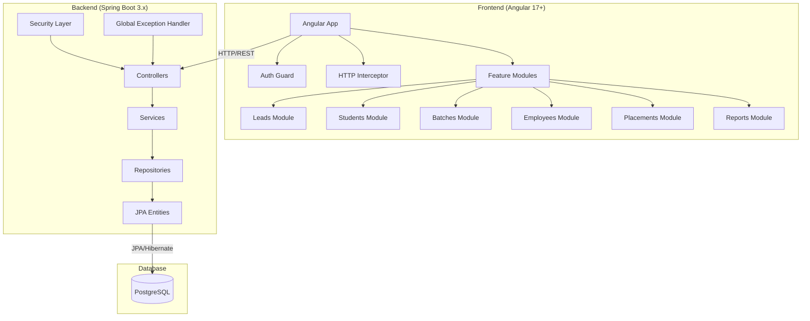

# Design Document

## Overview

The Educational Institute Management System follows a modern full-stack architecture with clear separation of concerns. The backend uses Spring Boot 3.x with Java 17, implementing a layered architecture pattern (Controller → Service → Repository) with PostgreSQL for data persistence. The frontend uses Angular 17+ with Angular Material for UI components, following a feature-based modular structure with lazy loading.

## Architecture

### System Architecture



### Backend Architecture Layers

1. **Controller Layer**: REST endpoints with @RestController, handles HTTP requests/responses
2. **Service Layer**: Business logic implementation with @Service annotation
3. **Repository Layer**: Data access using Spring Data JPA repositories
4. **Entity Layer**: JPA entities representing database tables
5. **Security Layer**: JWT-based authentication and RBAC authorization
6. **DTO Layer**: Data Transfer Objects for API request/response decoupling

### Frontend Architecture

1. **Core Module**: Singleton services, guards, interceptors
2. **Shared Module**: Reusable components, pipes, directives
3. **Feature Modules**: Lazy-loaded business modules
4. **Layout Module**: Application layouts (main, auth)

## Components and Interfaces

### Backend Components

#### 1. Security Components

**JwtAuthenticationFilter**
- Validates JWT tokens on incoming requests
- Extracts user information and sets security context

**JwtTokenProvider**
- Generates access and refresh tokens
- Validates token signatures and expiration

**UserDetailsServiceImpl**
- Loads user details for authentication
- Integrates with Employee entity for user data

#### 2. Entity Models

**Core Entities:**
- `Lead`: Potential student information and conversion tracking
- `Student`: Enrolled student details with batch assignments
- `Batch`: Class groupings with capacity management
- `Course`: Educational programs with duration and fees
- `Employee`: Staff information with role-based access
- `Placement`: Job placement records linking students and companies
- `Company`: Partner organizations for placements
- `User`: Authentication credentials linked to employees

**Entity Relationships:**
- Student → Batch (Many-to-One)
- Batch → Course (Many-to-One)
- Placement → Student (Many-to-One)
- Placement → Company (Many-to-One)
- User → Employee (One-to-One)

#### 3. Service Layer

**AuthService**
- Handles login, token refresh, logout operations
- Manages password changes and profile updates

**LeadService**
- Lead CRUD operations with status management
- Lead conversion to student functionality
- Follow-up tracking and reporting

**StudentService**
- Student enrollment and batch assignment
- Status tracking and history management
- Academic record maintenance

**BatchService**
- Batch creation with capacity constraints
- Student assignment validation
- Utilization reporting

**PlacementService**
- Placement record management
- Company relationship handling
- Statistics and reporting generation

#### 4. Controller Layer

All controllers follow RESTful conventions:
- Base path: `/api/v1`
- Standard HTTP methods (GET, POST, PUT, DELETE)
- Consistent response formats with DTOs
- Proper HTTP status codes

### Frontend Components

#### 1. Authentication Components

**LoginComponent**
- Reactive form with validation
- JWT token handling
- Role-based redirection

**AuthGuard**
- Route protection for authenticated users
- Token validation and refresh

**RoleGuard**
- Role-based route access control
- Permission validation

#### 2. Feature Components

**Lead Management**
- Lead list with filtering and pagination
- Lead form for creation/editing
- Conversion dialog for student creation
- Follow-up tracking interface

**Student Management**
- Student directory with search capabilities
- Enrollment form with batch selection
- Status management interface
- Academic record display

**Batch Management**
- Batch calendar view
- Capacity management interface
- Student assignment tools
- Utilization analytics

**Placement Management**
- Placement tracking dashboard
- Company management interface
- Statistics and reporting views
- Student-company matching tools

#### 3. Shared Components

**DataTableComponent**
- Reusable table with sorting, filtering, pagination
- Action buttons and bulk operations
- Export functionality

**ConfirmDialogComponent**
- Standardized confirmation dialogs
- Customizable messages and actions

**LoadingSpinnerComponent**
- Consistent loading indicators
- Global and component-level usage

## Data Models

### Database Schema

#### Core Tables

**leads**
```sql
- id (UUID, Primary Key)
- first_name (VARCHAR(50), NOT NULL)
- last_name (VARCHAR(50), NOT NULL)
- email (VARCHAR(100), UNIQUE)
- phone (VARCHAR(15), NOT NULL)
- course_interest (VARCHAR(100))
- source (VARCHAR(50))
- status (VARCHAR(20), DEFAULT 'NEW')
- created_date (TIMESTAMP)
- converted_date (TIMESTAMP)
- assigned_counsellor_id (UUID, FK to employees)
```

**students**
```sql
- id (UUID, Primary Key)
- enrollment_number (VARCHAR(20), UNIQUE, NOT NULL)
- first_name (VARCHAR(50), NOT NULL)
- last_name (VARCHAR(50), NOT NULL)
- email (VARCHAR(100), UNIQUE)
- phone (VARCHAR(15), NOT NULL)
- date_of_birth (DATE)
- address (TEXT)
- batch_id (UUID, FK to batches)
- status (VARCHAR(20), DEFAULT 'ACTIVE')
- enrollment_date (DATE, NOT NULL)
- lead_id (UUID, FK to leads)
```

**batches**
```sql
- id (UUID, Primary Key)
- name (VARCHAR(100), NOT NULL)
- course_id (UUID, FK to courses, NOT NULL)
- start_date (DATE, NOT NULL)
- end_date (DATE)
- capacity (INTEGER, NOT NULL)
- current_enrollment (INTEGER, DEFAULT 0)
- status (VARCHAR(20), DEFAULT 'PLANNED')
- instructor_id (UUID, FK to employees)
```

**courses**
```sql
- id (UUID, Primary Key)
- name (VARCHAR(100), NOT NULL)
- description (TEXT)
- duration_months (INTEGER, NOT NULL)
- fees (DECIMAL(10,2), NOT NULL)
- status (VARCHAR(20), DEFAULT 'ACTIVE')
```

**employees**
```sql
- id (UUID, Primary Key)
- employee_code (VARCHAR(20), UNIQUE, NOT NULL)
- first_name (VARCHAR(50), NOT NULL)
- last_name (VARCHAR(50), NOT NULL)
- email (VARCHAR(100), UNIQUE, NOT NULL)
- phone (VARCHAR(15))
- department (VARCHAR(50))
- role (VARCHAR(30), NOT NULL)
- hire_date (DATE, NOT NULL)
- status (VARCHAR(20), DEFAULT 'ACTIVE')
```

**placements**
```sql
- id (UUID, Primary Key)
- student_id (UUID, FK to students, NOT NULL)
- company_id (UUID, FK to companies, NOT NULL)
- position (VARCHAR(100), NOT NULL)
- salary (DECIMAL(10,2))
- placement_date (DATE, NOT NULL)
- status (VARCHAR(20), DEFAULT 'PLACED')
```

**companies**
```sql
- id (UUID, Primary Key)
- name (VARCHAR(100), NOT NULL)
- industry (VARCHAR(50))
- contact_person (VARCHAR(100))
- email (VARCHAR(100))
- phone (VARCHAR(15))
- address (TEXT)
- partnership_date (DATE)
- status (VARCHAR(20), DEFAULT 'ACTIVE')
```

**users**
```sql
- id (UUID, Primary Key)
- username (VARCHAR(50), UNIQUE, NOT NULL)
- password (VARCHAR(255), NOT NULL)
- employee_id (UUID, FK to employees, UNIQUE, NOT NULL)
- last_login (TIMESTAMP)
- status (VARCHAR(20), DEFAULT 'ACTIVE')
```

### DTO Models

#### Request DTOs
- `LoginRequestDTO`: username, password
- `LeadCreateDTO`: lead information without system fields
- `StudentEnrollmentDTO`: student details with batch assignment
- `BatchCreateDTO`: batch information with course reference

#### Response DTOs
- `AuthResponseDTO`: tokens and user information
- `LeadResponseDTO`: complete lead information with relationships
- `StudentResponseDTO`: student details with batch and course info
- `PlacementStatsDTO`: aggregated placement statistics

## Error Handling

### Backend Error Handling

**Global Exception Handler (@ControllerAdvice)**
```java
@ControllerAdvice
public class GlobalExceptionHandler {
    // Handles validation errors (400)
    // Handles authentication errors (401)
    // Handles authorization errors (403)
    // Handles resource not found (404)
    // Handles business logic errors (422)
    // Handles internal server errors (500)
}
```

**Standard Error Response Format**
```json
{
    "timestamp": "2024-01-15T10:30:00Z",
    "status": 400,
    "error": "Bad Request",
    "message": "Validation failed",
    "path": "/api/v1/students",
    "details": [
        {
            "field": "email",
            "message": "Email is required"
        }
    ]
}
```

### Frontend Error Handling

**HTTP Error Interceptor**
- Catches HTTP errors globally
- Displays user-friendly error messages
- Handles token refresh on 401 errors
- Logs errors for debugging

**Form Validation**
- Real-time validation with Angular Reactive Forms
- Custom validators for business rules
- Consistent error message display

## Testing Strategy

### Backend Testing

**Unit Tests**
- Service layer business logic testing
- Repository layer data access testing
- Controller layer endpoint testing
- Security configuration testing

**Integration Tests**
- End-to-end API testing with TestContainers
- Database integration testing
- Security integration testing

**Test Coverage**
- Minimum 80% code coverage
- Critical path 100% coverage
- Business logic comprehensive testing

### Frontend Testing

**Unit Tests**
- Component logic testing with Jasmine/Karma
- Service method testing
- Pipe and directive testing

**Integration Tests**
- Component integration testing
- HTTP service integration testing
- Route guard testing

**E2E Tests**
- User workflow testing with Cypress
- Cross-browser compatibility testing
- Responsive design testing

### Testing Tools and Frameworks

**Backend:**
- JUnit 5 for unit testing
- Mockito for mocking
- TestContainers for integration testing
- Spring Boot Test for application context testing

**Frontend:**
- Jasmine/Karma for unit testing
- Cypress for E2E testing
- Angular Testing Utilities
- Mock HTTP responses for service testing

### Performance Testing

**Backend Performance**
- API response time monitoring
- Database query optimization
- Load testing with JMeter
- Memory usage profiling

**Frontend Performance**
- Bundle size optimization
- Lazy loading implementation
- Change detection optimization
- Network request optimization